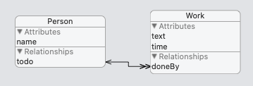

# Core Data

**Core Data** It is an object graph and persistence framework provided by Apple. It provides generalized and automated solutions to common tasks associated with object life cycle and object graph management, including persistence

**Ưu điểm:**

1. Much better memory management
2. When you have changes, you can save only the changed objects, not the entire data set.
3. You can read/write your model objects directly instead of converting them to/from something like an NSDictionary
4. Built-in sorting of objects when you fetch them from the data store.
5. Rich system of predicates for searching your data set
6. Others.[https://stackoverflow.com/a/6377850](https://stackoverflow.com/a/6377850)

**Nhược điểm:**

1. Có thể là 1 framework khá khó học cho người mới
2. Liên quan đến cơ chế của Core Data. Muốn thay đổi dữ liệu của object thì phải load object vào memory ⇒ Muốn xoá 1000 records thì phải load 1000 records đó vào memory để xoá ⇒ Dư thừa

#### NSPersistentContainer

* Tools to load your data model.
* Tools to read and write your data to persistent storage.
* Tools that create a space for you to change your data before saving it.

#### NSManagedObjectContext

* Enables you to fetch specific data objects from persistent storage
* Manages object changes in memory until written to the persistent store
* Allows you to undo changes
* Has the ability to perform data object work in the background

### More deep explanation and visualization with delete rule.

***

Let be assume we have database with table person and work. Single person can have many tasks to do.

> **Sample data and ER relationship**

> .png>).png>).png>)

***

### Delete Rule Explation

1. **No Action :** If I add this delete rule on relationship and then delete one of the person then it will not do anything with the task but person got deleted. _The task still points to the person that we deleted._

* **Use Case:** I don't think it is used anywhere.

2. **Nullify :** If I apply this delete rule and delete the person then associate tasks will points to the null person. For example, I deleted the thor and thor tasks will point to the null person. Check below output.

* **Use Case :** Let's assume we have DB with Person and address. Now person sells his house to broker. In this case you can null the person of that address and reassign the owner to that house when new Person purchased that house.

3. **Cascade :** In this rule, if I deletes the person then it will deletes all the tasks associated with that person. For example, I deletes the Spiderman, check below output.

.png>)

* **Use Case:** Let be assume we have a user and his friends list. If user account deleted then we also want to delete the friend list.

4. **Deny :** Now we have person i.e. IronMan with 2 tasks. In this rule, if I try to delete the Iron Man then it does not allow me to do. It gives error `"The operation couldn’t be completed. (Cocoa error 1600.)"` on saving the context. Now to delete the Iron Man person, we need to delete all his associated tasks and then we could able to delete the Person.

* **Use Case:** Lets assume, there is a user with bank account. We can not delete the user from the bank until his account is not closed.
