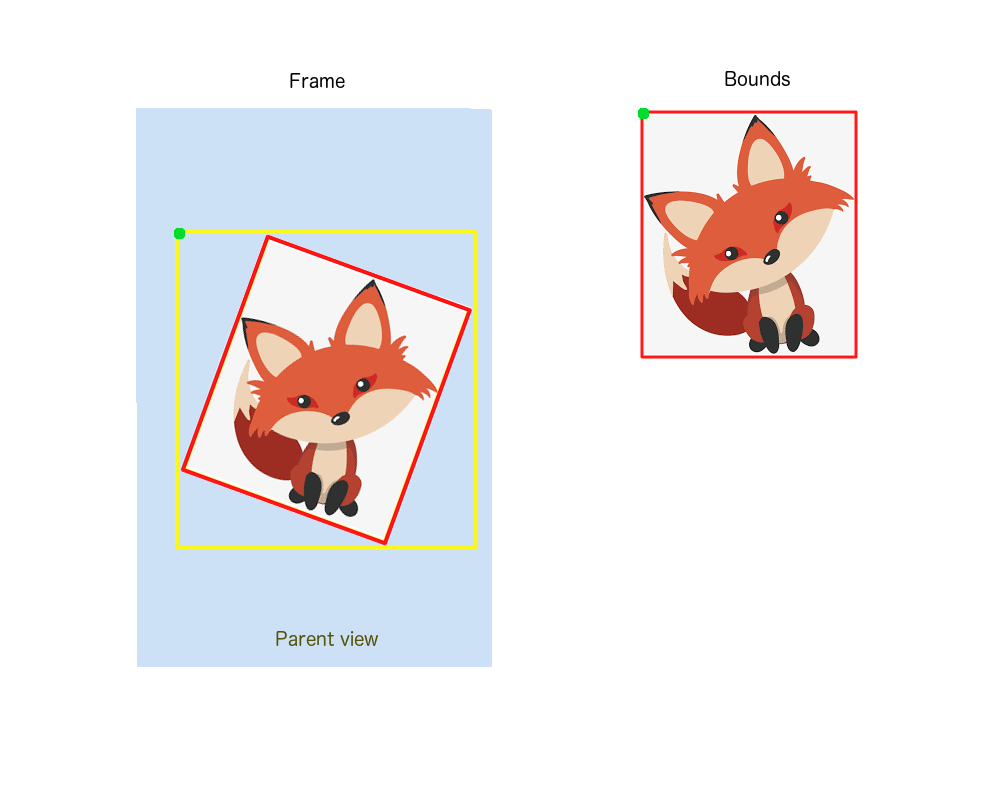

# Frame và Bounds

* Frame: vị trí và kích thước được xác định bằng hệ thống toạ độ của view cha
* Bounds: vị trí và kích thước được xác định bằng hệ thống toạ độ của chính nó

<figure><figcaption></figcaption></figure>

```
Frame
   origin = (20, 52)
   width = 118
   height = 187
 
Bounds 
   origin = (0, 0)
   width = 80
   height = 130
```
