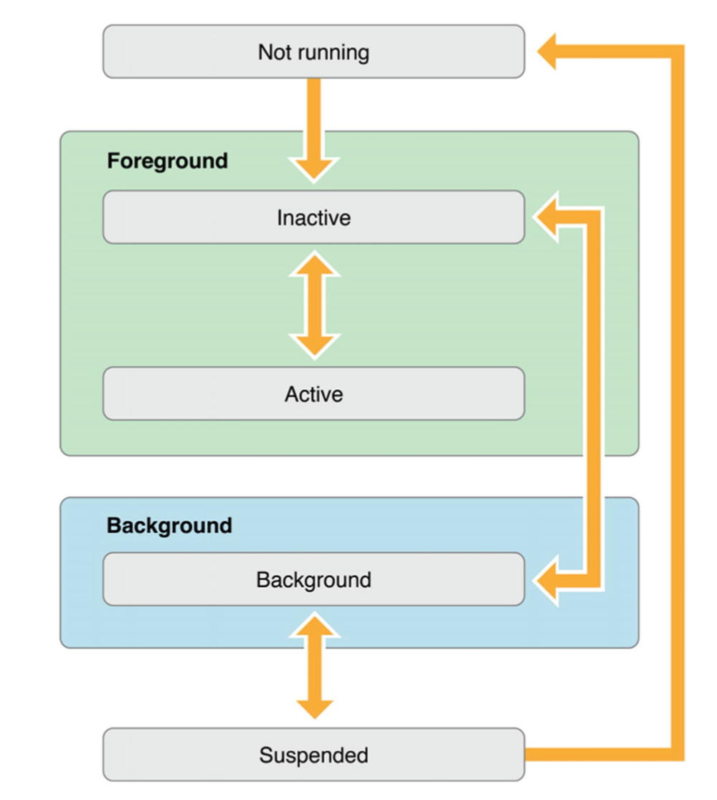

# iOS app lifecycle

Khi app khởi động, sẽ nhảy vào hàm willFinishLaunchingWithOptions và didFinishLaunchingWithOptions (hàm này chúng ta thường dùng để enable 1 số service như: IQKeyboard, Firebase, …

<figure><figcaption>
Hình 1: iOS app life cycle
</figcaption></figure>

Ngoài ra, ứng dụng iOS sẽ nằm 1 trong 5 trạng thái sau đây:

* Active (Foreground): Khi ứng dụng đang hoạt động bình thường, chúng ta thao tác trên đó
* Inactive (Foreground): nếu có sự kiện từ hệ thống (như có tin nhắn mới, có điện thoại) thì ứng dụng chuyển về **Inactive**
* Background: Khi người dùng bấm phím Home (ẩn ứng dụng xuống nền), ứng dụng sẽ chuyển sang trạng thái background. Ở trạng thái này, ứng dụng không hiển thị với người dùng nhưng vẫn thực hiện các dòng lệnh
* Suspended: Ứng dụng ở trạng thái background nhưng không còn thực hiện dòng lệnh. Sau 5-10 giây thì bị đóng băng tạm thời
* Not running: Điện thoại cần memory để chạy 1 ứng dụng khác, thì ứng dụng ở trạng thái suspended sẽ bị chấm dứt và chuyển xuống trạng thái **Not running**
