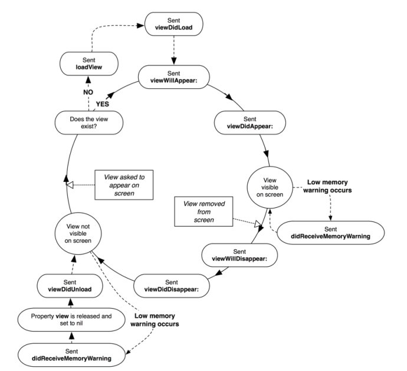

# UIViewController lifecycle

<figure><figcaption>
Hình 1: UIViewController lifecycle
</figcaption></figure>

* Hàm init sẽ được gọi đầu tiên. init(coder:) nếu ViewController được tạo từ storyboard và init(nibName:bundle:) nếu được tạo từ nib file (thay vì storyboard)
* loadView(): chỉ override method này khi muốn build lại toàn bộ UI cho ViewController bằng code. Nếu dùng storyboard hoặc nib thì không nên đụng vào hàm này. Hàm này được implement trong lúc UIViewController load interface và connect các outlet/action
* viewDidLoad(): Method chỉ được gọi duy nhất 1 lần trong lifetime của ViewController. Lúc này UIViewController đã được tạo và outlet/action đã sẵn sàng. Thường chúng ta sẽ thao tác với hàm này rất nhiều
* viewWillAppear(): Method được gọi nhiều lần mỗi khi ViewController xuất hiện lên màn hình. Thông báo cho ViewController rằng view này chuẩn bị được thêm vào view hierarchy
* viewWillLayoutSubviews: được gọi để thông báo cho ViewController rằng view chuẩn bị layout các subview. Method này được gọi mỗi khi frame có sự thay đổi (ví dụ khi quay hoặc subview cần được layout)
* viewDidLayoutSubviews: được gọi để thông báo cho ViewController rằng view vừa layout lại các subview. Ta thường dùng hàm này để thực hiện thêm các thay đổi sau khi layout subview
* viewDidAppear(): method được gọi khi ViewController đã hiện thị trên màn hình
* viewWillDisappear và viewDidDisappear
* deinit(): trước khi ViewController bị remove khỏi memory
* didReceiveMemoryWarning()
