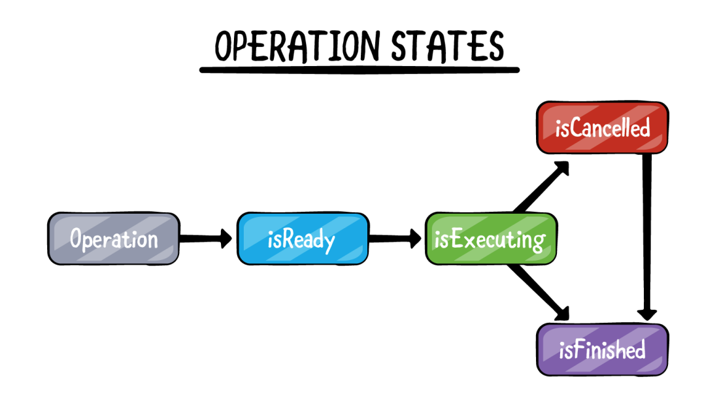

# Operation Queue

Cũng là một cách để thực hiện đa luồng trong iOS. Giúp quản lý/tracking sâu hơn vào 1 tác vụ (operation) trong queue.

Operation: Sẽ đóng gói và thực hiện 1 task.

OperationQueue: Là nơi chứa nhiều operation. Operation có thể huỷ (cancel). Cũng có thể kiểm tra trạng thái của task đó như thế nào (Đang làm, làm xong rồi).

<figure><figcaption></figcaption></figure>

An operation can be in several states, depending on its current execution status.

* **Ready:** It’s prepared to start
* **Executing:** The task is currently running
* **Finished:** Once the process is completed
* **Cancelled:** The task cancelled

Chúng ta thêm task vào hàng đợi bằng cách sử dụng BlockOperation. Có thể sử dụng method start() để bắt đầu task hoặc thêm BlockOperation đó vào OperationQueue (khuyến khích cách này)

**Ưu điểm:** là 1 số ý đã nêu ở nhược điểm GCD
