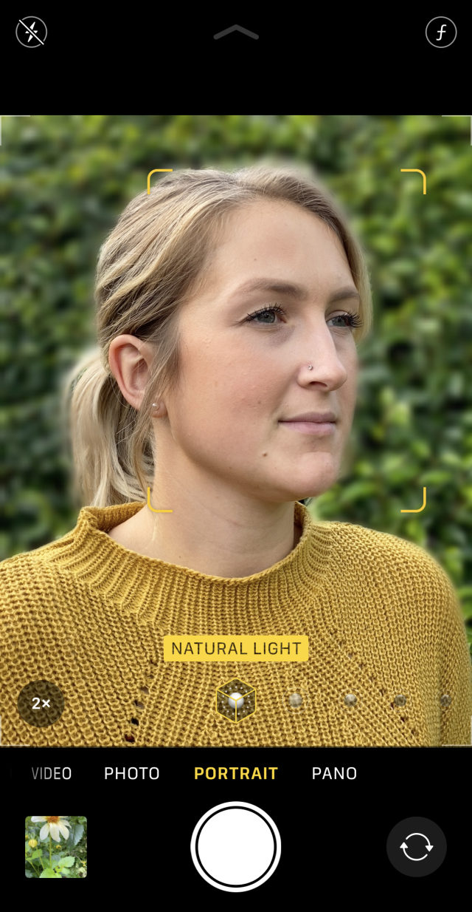
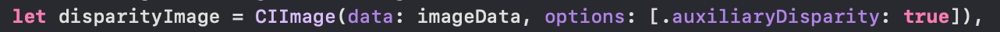
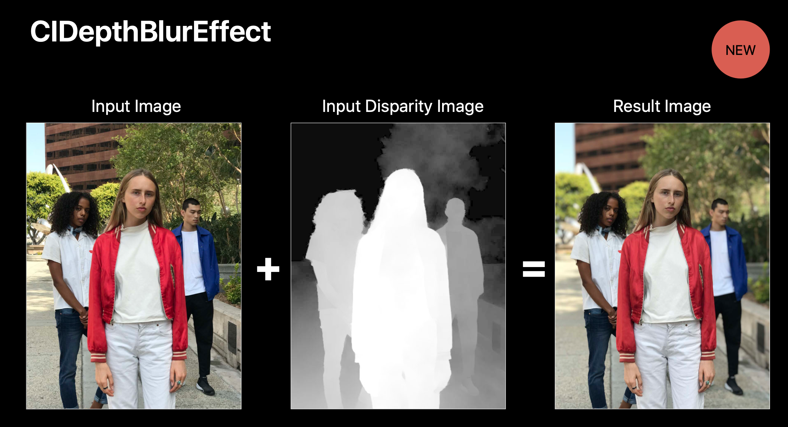
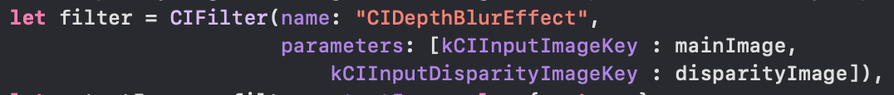

# Portrait effect on custom camera

## 1. Giới thiệu

Ở camera iPhone khi chúng ta chọn chế độ PORTRAIT (chế độ chụp ảnh chân dung), thì phía sau khuôn mặt của chúng ta khi chụp ảnh sẽ được làm mờ (blur) đi như hình bên dưới:

<figure><figcaption>
Hình 1: Chế độ chân dung của iPhone
</figcaption></figure>

Vậy nếu chúng ta muốn sử dụng hiệu ứng làm mờ background phía sau khuôn mặt vào custom camera trong một ứng dụng iOS thì chúng ta phải làm như thế nào? Không may thay, mình chưa tìm ra được một cách nào dễ dàng để có được hiệu ứng này.

## 2. Cách giải quyết

Vậy để đạt được hiệu ứng blur background như chế độ PORTRAIT của native camera iPhone. Chúng ta phải làm như thế nào?

1. Đầu tiên, khi chúng ta chụp 1 bức ảnh. Chúng ta cũng đồng thời phải lấy được depth map của bức ảnh đó. Vậy depth map là gì? Phải làm sao để lấy được depth map? Chúng ta sẽ tìm hiểu ở phần ngay sau đây.
2. Sau khi có được 1 ảnh gốc và 1 ảnh depth map. Chúng ta sẽ kết hợp lại với nhau để được 1 bức ảnh có hiệu ứng làm mờ background tương tự chế độ PORTRAIT

Bức ảnh sau đây mô tả rõ hơn cách chúng ta sẽ thực hiện:

<figure><figcaption>
Hình 2: Cơ chế tạo ra ảnh có hiệu ứng giống chụp chân dung ở iPhone
</figcaption></figure>

### 2.1. Depth map là gì?

Depth map như là một bức ảnh. Tuy nhiên khác với bức ảnh bình thường cung cấp màu sắc, depth map lại cung cấp khoảng cách từ camera đến vật thể. Như bức ảnh trên chúng ta thấy, vật nằm càng gần camera thì có màu càng trắng, ngược lại càng xa camera thì càng tối.

### 2.2. Cách lấy depth map

Về cách chi tiết để lấy được depth map, chúng ta sẽ thực hiện ở mục 3 - demo. Tuy nhiên, để lấy được depth map chúng ta thực hiện dòng code sau đây. Khi auxiliaryDisparity = true thì disparityImage sẽ là 1 bức ảnh depth map

<figure><figcaption>
Hình 3: Cách lấy depth map
</figcaption></figure>

### 2.3. Kết hợp ảnh gốc và depth map

Mình tìm thấy bức ảnh này ở tài liệu được giới thiệu vào WWDC 2017 (image editing with depth) sẽ đính kèm link ở chương cuối:

<figure><figcaption>
Hình 4: Hiệu ứng CIDepthBlurEffect để tạo ra ảnh có hiệu ứng chân dung
</figcaption></figure>

Như chúng ta thấy ở trên, chúng ta sẽ sử dụng filter tên là “CIDepthBlurEffect” để kết hợp 2 ảnh gốc và depth map lại với nhau. Cụ thể như dòng code bên dưới:

<figure><figcaption>
Hình 5: Cách dùng CIDepthBlurEffect
</figcaption></figure>

## 3. Thử nghiệm chương trình

Đây là [source code](https://github.com/kien-hoang/portrait\_camera\_effect) hoàn chỉnh, mọi người có thể tải về và chạy trên máy thật

<figure><figcaption>
Hình 6: Ảnh gốc khi chụp bằng camera ở ứng dụng iOS
</figcaption></figure>

 

<figure><figcaption>
Hình 7: Ảnh nhận được sau khi kết hợp ảnh gốc và depth map
</figcaption></figure>

## 4. Tài liệu tham khảo

* [https://developer.apple.com/documentation/avfoundation/cameras\_and\_media\_capture/capturing\_photos\_with\_depth](https://developer.apple.com/documentation/avfoundation/cameras\_and\_media\_capture/capturing\_photos\_with\_depth)
* [https://devstreaming-cdn.apple.com/videos/wwdc/2017/508wdyl5rm2jy9z8/508/508\_image\_editing\_with\_depth.pdf?dl=1](https://devstreaming-cdn.apple.com/videos/wwdc/2017/508wdyl5rm2jy9z8/508/508\_image\_editing\_with\_depth.pdf?dl=1)
* [https://stackoverflow.com/a/49308754](https://stackoverflow.com/a/49308754)
