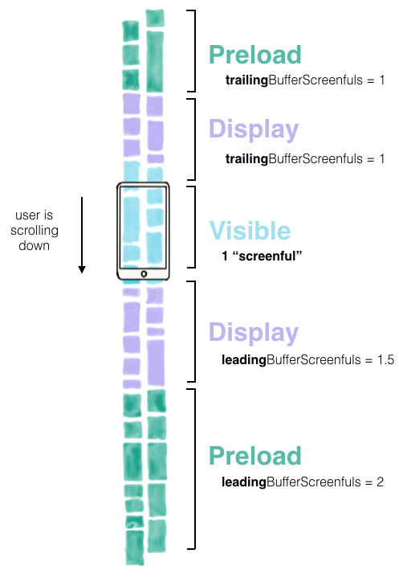

# Texture (AsyncDisplayKit)

Texture được build bởi Facebook, là 1 framework của iOS giúp ứng dụng có UI phức tạp trở nên mượt mà và phản hồi tốt. Đơn vị của Texture là **node**. Không giống như **views** (chỉ được dùng trên main thread), node thể khởi tạo vào cấu hình toàn bộ hierarchies (nôm na là cây thư mục cấu tạo nên node ???) song song trong background threads

Texture cho phép đưa image decoding, text sizing, rendering hoặc nhiều hoạt động UI phức tạp khác ra khỏi main thread

⇒ Giúp main thread ít trách nhiệm nhất ⇒ Sẵn sàng hoạt động khi user interaction ⇒ Mượt vl

<figure><figcaption>
Photo 1: How Texture layout in table view
</figcaption></figure>
